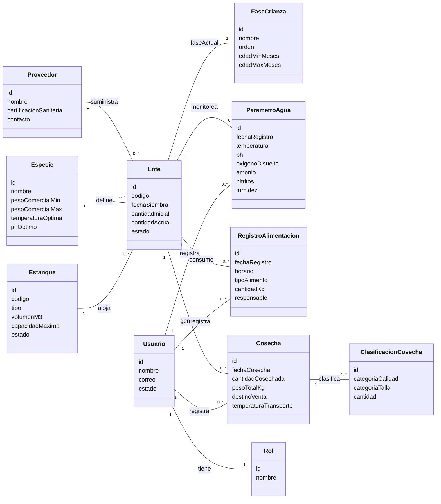

# Diagrama de Clases Conceptuales (Logica de Negocio)

```mermaid
classDiagram
direction LR

class Lote {
  id
  codigo
  fechaSiembra
  cantidadInicial
  cantidadActual
  estado
}

class Estanque {
  id
  codigo
  tipo
  volumenM3
  capacidadMaxima
  estado
}

class Especie {
  id
  nombre
  pesoComercialMin
  pesoComercialMax
  temperaturaOptima
  phOptimo
}

class Proveedor {
  id
  nombre
  certificacionSanitaria
  contacto
}

class FaseCrianza {
  id
  nombre
  orden
  edadMinMeses
  edadMaxMeses
}

class ParametroAgua {
  id
  fechaRegistro
  temperatura
  ph
  oxigenoDisuelto
  amonio
  nitritos
  turbidez
}

class RegistroAlimentacion {
  id
  fechaRegistro
  horario
  tipoAlimento
  cantidadKg
  responsable
}

class Cosecha {
  id
  fechaCosecha
  cantidadCosechada
  pesoTotalKg
  destinoVenta
  temperaturaTransporte
}

class ClasificacionCosecha {
  id
  categoriaCalidad
  categoriaTalla
  cantidad
}

class Usuario {
  id
  nombre
  correo
  estado
}

class Rol {
  id
  nombre
}

Proveedor "1" -- "0..*" Lote : suministra
Especie "1" -- "0..*" Lote : define
Estanque "1" -- "0..*" Lote : aloja
Lote "1" -- "1" FaseCrianza : faseActual
Lote "1" -- "0..*" ParametroAgua : monitorea
Lote "1" -- "0..*" RegistroAlimentacion : consume
Lote "1" -- "0..*" Cosecha : genera
Cosecha "1" -- "1..*" ClasificacionCosecha : clasifica
Usuario "1" -- "1" Rol : tiene
Usuario "1" -- "0..*" ParametroAgua : registra
Usuario "1" -- "0..*" RegistroAlimentacion : registra
Usuario "1" -- "0..*" Cosecha : registra
```

