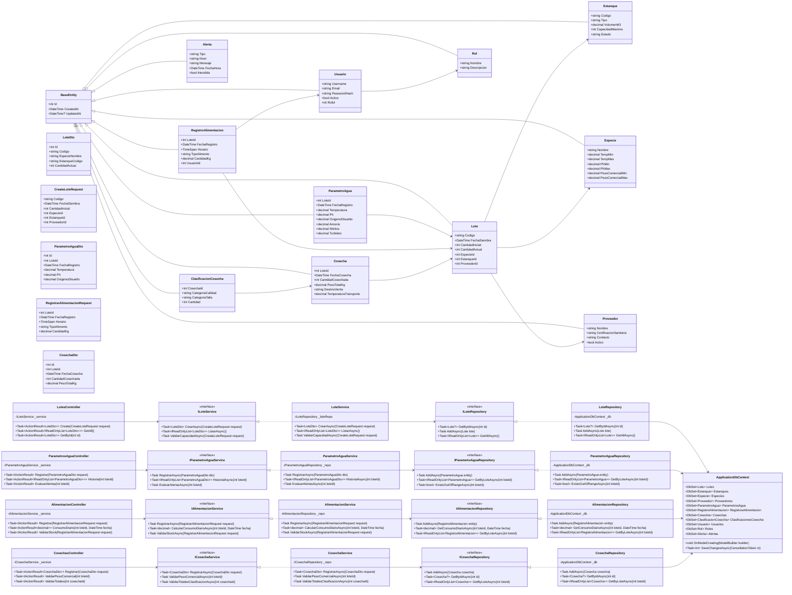

# Diagrama de Clases de Diseño (Backend)

```mermaid
classDiagram
direction LR

class BaseEntity {
  +int Id
  +DateTime CreatedAt
  +DateTime? UpdatedAt
}

class Lote {
  +string Codigo
  +DateTime FechaSiembra
  +int CantidadInicial
  +int CantidadActual
  +int EspecieId
  +int EstanqueId
  +int ProveedorId
}
BaseEntity <|-- Lote

class Estanque {
  +string Codigo
  +string Tipo
  +decimal VolumenM3
  +int CapacidadMaxima
  +string Estado
}
BaseEntity <|-- Estanque

class Especie {
  +string Nombre
  +decimal TempMin
  +decimal TempMax
  +decimal PhMin
  +decimal PhMax
  +decimal PesoComercialMin
  +decimal PesoComercialMax
}
BaseEntity <|-- Especie

class Proveedor {
  +string Nombre
  +string CertificacionSanitaria
  +string Contacto
  +bool Activo
}
BaseEntity <|-- Proveedor

class ParametroAgua {
  +int LoteId
  +DateTime FechaRegistro
  +decimal Temperatura
  +decimal Ph
  +decimal OxigenoDisuelto
  +decimal Amonio
  +decimal Nitritos
  +decimal Turbidez
}
BaseEntity <|-- ParametroAgua

class RegistroAlimentacion {
  +int LoteId
  +DateTime FechaRegistro
  +TimeSpan Horario
  +string TipoAlimento
  +decimal CantidadKg
  +int UsuarioId
}
BaseEntity <|-- RegistroAlimentacion

class Cosecha {
  +int LoteId
  +DateTime FechaCosecha
  +int CantidadCosechada
  +decimal PesoTotalKg
  +string DestinoVenta
  +decimal TemperaturaTransporte
}
BaseEntity <|-- Cosecha

class ClasificacionCosecha {
  +int CosechaId
  +string CategoriaCalidad
  +string CategoriaTalla
  +int Cantidad
}
BaseEntity <|-- ClasificacionCosecha

class Usuario {
  +string Username
  +string Email
  +string PasswordHash
  +bool Activo
  +int RolId
}
BaseEntity <|-- Usuario

class Rol {
  +string Nombre
  +string Descripcion
}
BaseEntity <|-- Rol

class Alerta {
  +string Tipo
  +string Nivel
  +string Mensaje
  +DateTime FechaHora
  +bool Atendida
}
BaseEntity <|-- Alerta

class ApplicationDbContext {
  +DbSet~Lote~ Lotes
  +DbSet~Estanque~ Estanques
  +DbSet~Especie~ Especies
  +DbSet~Proveedor~ Proveedores
  +DbSet~ParametroAgua~ ParametrosAgua
  +DbSet~RegistroAlimentacion~ RegistrosAlimentacion
  +DbSet~Cosecha~ Cosechas
  +DbSet~ClasificacionCosecha~ ClasificacionesCosecha
  +DbSet~Usuario~ Usuarios
  +DbSet~Rol~ Roles
  +DbSet~Alerta~ Alertas
  +void OnModelCreating(ModelBuilder builder)
  +Task~int~ SaveChangesAsync(CancellationToken ct)
}

class LoteDto {
  +int Id
  +string Codigo
  +string EspecieNombre
  +string EstanqueCodigo
  +int CantidadActual
}

class CreateLoteRequest {
  +string Codigo
  +DateTime FechaSiembra
  +int CantidadInicial
  +int EspecieId
  +int EstanqueId
  +int ProveedorId
}

class ParametroAguaDto {
  +int Id
  +int LoteId
  +DateTime FechaRegistro
  +decimal Temperatura
  +decimal Ph
  +decimal OxigenoDisuelto
}

class RegistrarAlimentacionRequest {
  +int LoteId
  +DateTime FechaRegistro
  +TimeSpan Horario
  +string TipoAlimento
  +decimal CantidadKg
}

class CosechaDto {
  +int Id
  +int LoteId
  +DateTime FechaCosecha
  +int CantidadCosechada
  +decimal PesoTotalKg
}

class ILoteRepository {
  <<interface>>
  +Task~Lote?~ GetByIdAsync(int id)
  +Task AddAsync(Lote lote)
  +Task~IReadOnlyList~Lote~~ GetAllAsync()
}

class IParametroAguaRepository {
  <<interface>>
  +Task AddAsync(ParametroAgua entity)
  +Task~IReadOnlyList~ParametroAgua~~ GetByLoteAsync(int loteId)
  +Task~bool~ ExistsOutOfRangeAsync(int loteId)
}

class IAlimentacionRepository {
  <<interface>>
  +Task AddAsync(RegistroAlimentacion entity)
  +Task~decimal~ GetConsumoDiarioAsync(int loteId, DateTime fecha)
  +Task~IReadOnlyList~RegistroAlimentacion~~ GetByLoteAsync(int loteId)
}

class ICosechaRepository {
  <<interface>>
  +Task AddAsync(Cosecha cosecha)
  +Task~Cosecha?~ GetByIdAsync(int id)
  +Task~IReadOnlyList~Cosecha~~ GetByLoteAsync(int loteId)
}

class LoteRepository {
  -ApplicationDbContext _db
  +Task~Lote?~ GetByIdAsync(int id)
  +Task AddAsync(Lote lote)
  +Task~IReadOnlyList~Lote~~ GetAllAsync()
}
ILoteRepository <|.. LoteRepository

class ParametroAguaRepository {
  -ApplicationDbContext _db
  +Task AddAsync(ParametroAgua entity)
  +Task~IReadOnlyList~ParametroAgua~~ GetByLoteAsync(int loteId)
  +Task~bool~ ExistsOutOfRangeAsync(int loteId)
}
IParametroAguaRepository <|.. ParametroAguaRepository

class AlimentacionRepository {
  -ApplicationDbContext _db
  +Task AddAsync(RegistroAlimentacion entity)
  +Task~decimal~ GetConsumoDiarioAsync(int loteId, DateTime fecha)
  +Task~IReadOnlyList~RegistroAlimentacion~~ GetByLoteAsync(int loteId)
}
IAlimentacionRepository <|.. AlimentacionRepository

class CosechaRepository {
  -ApplicationDbContext _db
  +Task AddAsync(Cosecha cosecha)
  +Task~Cosecha?~ GetByIdAsync(int id)
  +Task~IReadOnlyList~Cosecha~~ GetByLoteAsync(int loteId)
}
ICosechaRepository <|.. CosechaRepository

class ILoteService {
  <<interface>>
  +Task~LoteDto~ CrearAsync(CreateLoteRequest request)
  +Task~IReadOnlyList~LoteDto~~ ListarAsync()
  +Task ValidarCapacidadAsync(CreateLoteRequest request)
}

class IParametroAguaService {
  <<interface>>
  +Task RegistrarAsync(ParametroAguaDto dto)
  +Task~IReadOnlyList~ParametroAguaDto~~ HistorialAsync(int loteId)
  +Task EvaluarAlertasAsync(int loteId)
}

class IAlimentacionService {
  <<interface>>
  +Task RegistrarAsync(RegistrarAlimentacionRequest request)
  +Task~decimal~ CalcularConsumoDiarioAsync(int loteId, DateTime fecha)
  +Task ValidarStockAsync(RegistrarAlimentacionRequest request)
}

class ICosechaService {
  <<interface>>
  +Task~CosechaDto~ RegistrarAsync(CosechaDto request)
  +Task ValidarPesoComercialAsync(int loteId)
  +Task ValidarTotalesClasificacionAsync(int cosechaId)
}

class LoteService {
  -ILoteRepository _loteRepo
  +Task~LoteDto~ CrearAsync(CreateLoteRequest request)
  +Task~IReadOnlyList~LoteDto~~ ListarAsync()
  +Task ValidarCapacidadAsync(CreateLoteRequest request)
}
ILoteService <|.. LoteService

class ParametroAguaService {
  -IParametroAguaRepository _repo
  +Task RegistrarAsync(ParametroAguaDto dto)
  +Task~IReadOnlyList~ParametroAguaDto~~ HistorialAsync(int loteId)
  +Task EvaluarAlertasAsync(int loteId)
}
IParametroAguaService <|.. ParametroAguaService

class AlimentacionService {
  -IAlimentacionRepository _repo
  +Task RegistrarAsync(RegistrarAlimentacionRequest request)
  +Task~decimal~ CalcularConsumoDiarioAsync(int loteId, DateTime fecha)
  +Task ValidarStockAsync(RegistrarAlimentacionRequest request)
}
IAlimentacionService <|.. AlimentacionService

class CosechaService {
  -ICosechaRepository _repo
  +Task~CosechaDto~ RegistrarAsync(CosechaDto request)
  +Task ValidarPesoComercialAsync(int loteId)
  +Task ValidarTotalesClasificacionAsync(int cosechaId)
}
ICosechaService <|.. CosechaService

class LotesController {
  -ILoteService _service
  +Task~ActionResult~LoteDto~~ Create(CreateLoteRequest request)
  +Task~ActionResult~IReadOnlyList~LoteDto~~~ GetAll()
  +Task~ActionResult~LoteDto~~ GetById(int id)
}

class ParametrosAguaController {
  -IParametroAguaService _service
  +Task~IActionResult~ Registrar(ParametroAguaDto request)
  +Task~ActionResult~IReadOnlyList~ParametroAguaDto~~~ Historial(int loteId)
  +Task~IActionResult~ EvaluarAlertas(int loteId)
}

class AlimentacionController {
  -IAlimentacionService _service
  +Task~IActionResult~ Registrar(RegistrarAlimentacionRequest request)
  +Task~ActionResult~decimal~~ ConsumoDiario(int loteId, DateTime fecha)
  +Task~IActionResult~ ValidarStock(RegistrarAlimentacionRequest request)
}

class CosechasController {
  -ICosechaService _service
  +Task~ActionResult~CosechaDto~~ Registrar(CosechaDto request)
  +Task~IActionResult~ ValidarPesoComercial(int loteId)
  +Task~IActionResult~ ValidarTotales(int cosechaId)
}

LoteRepository --> ApplicationDbContext
ParametroAguaRepository --> ApplicationDbContext
AlimentacionRepository --> ApplicationDbContext
CosechaRepository --> ApplicationDbContext

LoteService --> ILoteRepository
ParametroAguaService --> IParametroAguaRepository
AlimentacionService --> IAlimentacionRepository
CosechaService --> ICosechaRepository

LotesController --> ILoteService
ParametrosAguaController --> IParametroAguaService
AlimentacionController --> IAlimentacionService
CosechasController --> ICosechaService

Lote --> Especie
Lote --> Estanque
Lote --> Proveedor
ParametroAgua --> Lote
RegistroAlimentacion --> Lote
Cosecha --> Lote
ClasificacionCosecha --> Cosecha
Usuario --> Rol
RegistroAlimentacion --> Usuario
```

