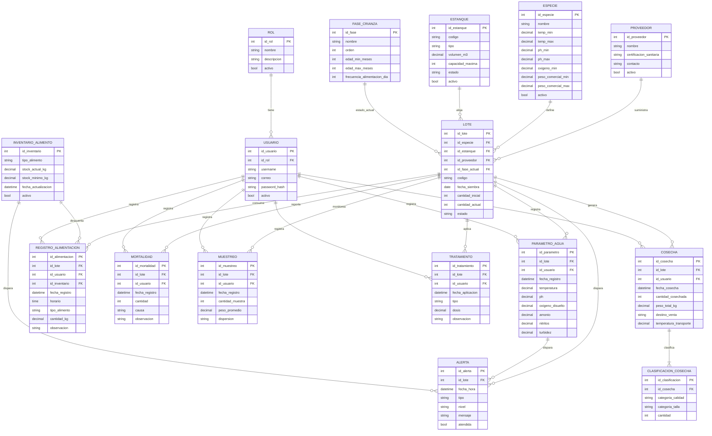
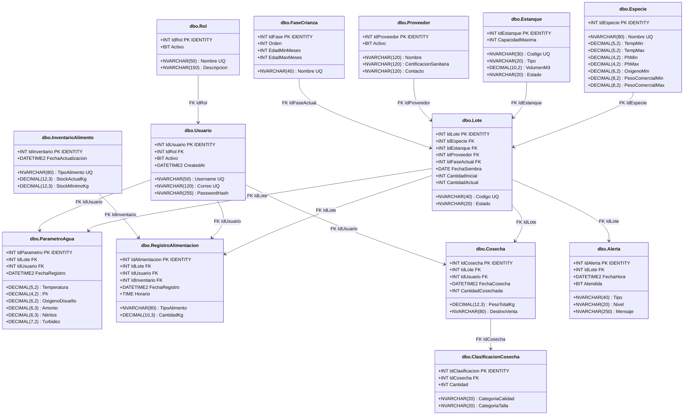

# Diagrama Logico y Fisico de Base de Datos (Propuesta)

## 1) Modelo logico (ER)

```mermaid
erDiagram
    ROL ||--o{ USUARIO : tiene
    PROVEEDOR ||--o{ LOTE : suministra
    ESPECIE ||--o{ LOTE : define
    ESTANQUE ||--o{ LOTE : aloja
    FASE_CRIANZA ||--o{ LOTE : estado_actual

    LOTE ||--o{ PARAMETRO_AGUA : registra
    LOTE ||--o{ REGISTRO_ALIMENTACION : consume
    LOTE ||--o{ MORTALIDAD : reporta
    LOTE ||--o{ MUESTREO : monitorea
    LOTE ||--o{ TRATAMIENTO : aplica
    LOTE ||--o{ COSECHA : genera

    COSECHA ||--|{ CLASIFICACION_COSECHA : clasifica
    INVENTARIO_ALIMENTO ||--o{ REGISTRO_ALIMENTACION : descuenta

    USUARIO ||--o{ PARAMETRO_AGUA : registra
    USUARIO ||--o{ REGISTRO_ALIMENTACION : registra
    USUARIO ||--o{ TRATAMIENTO : registra
    USUARIO ||--o{ COSECHA : registra
    USUARIO ||--o{ MORTALIDAD : registra
    USUARIO ||--o{ MUESTREO : registra

    LOTE ||--o{ ALERTA : dispara
    PARAMETRO_AGUA ||--o{ ALERTA : dispara
    INVENTARIO_ALIMENTO ||--o{ ALERTA : dispara

    ROL {
      int id_rol PK
      string nombre
      string descripcion
      bool activo
    }

    USUARIO {
      int id_usuario PK
      int id_rol FK
      string username
      string correo
      string password_hash
      bool activo
    }

    PROVEEDOR {
      int id_proveedor PK
      string nombre
      string certificacion_sanitaria
      string contacto
      bool activo
    }

    ESPECIE {
      int id_especie PK
      string nombre
      decimal temp_min
      decimal temp_max
      decimal ph_min
      decimal ph_max
      decimal oxigeno_min
      decimal peso_comercial_min
      decimal peso_comercial_max
      bool activo
    }

    ESTANQUE {
      int id_estanque PK
      string codigo
      string tipo
      decimal volumen_m3
      int capacidad_maxima
      string estado
      bool activo
    }

    FASE_CRIANZA {
      int id_fase PK
      string nombre
      int orden
      int edad_min_meses
      int edad_max_meses
      int frecuencia_alimentacion_dia
    }

    LOTE {
      int id_lote PK
      int id_especie FK
      int id_estanque FK
      int id_proveedor FK
      int id_fase_actual FK
      string codigo
      date fecha_siembra
      int cantidad_inicial
      int cantidad_actual
      string estado
    }

    PARAMETRO_AGUA {
      int id_parametro PK
      int id_lote FK
      int id_usuario FK
      datetime fecha_registro
      decimal temperatura
      decimal ph
      decimal oxigeno_disuelto
      decimal amonio
      decimal nitritos
      decimal turbidez
    }

    INVENTARIO_ALIMENTO {
      int id_inventario PK
      string tipo_alimento
      decimal stock_actual_kg
      decimal stock_minimo_kg
      datetime fecha_actualizacion
      bool activo
    }

    REGISTRO_ALIMENTACION {
      int id_alimentacion PK
      int id_lote FK
      int id_usuario FK
      int id_inventario FK
      datetime fecha_registro
      time horario
      string tipo_alimento
      decimal cantidad_kg
      string observacion
    }

    MORTALIDAD {
      int id_mortalidad PK
      int id_lote FK
      int id_usuario FK
      datetime fecha_registro
      int cantidad
      string causa
      string observacion
    }

    MUESTREO {
      int id_muestreo PK
      int id_lote FK
      int id_usuario FK
      datetime fecha_registro
      int cantidad_muestra
      decimal peso_promedio
      string dispersion
    }

    TRATAMIENTO {
      int id_tratamiento PK
      int id_lote FK
      int id_usuario FK
      datetime fecha_aplicacion
      string tipo
      decimal dosis
      string observacion
    }

    COSECHA {
      int id_cosecha PK
      int id_lote FK
      int id_usuario FK
      datetime fecha_cosecha
      int cantidad_cosechada
      decimal peso_total_kg
      string destino_venta
      decimal temperatura_transporte
    }

    CLASIFICACION_COSECHA {
      int id_clasificacion PK
      int id_cosecha FK
      string categoria_calidad
      string categoria_talla
      int cantidad
    }

    ALERTA {
      int id_alerta PK
      int id_lote FK
      datetime fecha_hora
      string tipo
      string nivel
      string mensaje
      bool atendida
    }
```

## 2) Modelo fisico propuesto (SQL Server)

```mermaid
classDiagram
direction TB

class dbo.Rol {
  +INT IdRol PK IDENTITY
  +NVARCHAR(50) Nombre UQ
  +NVARCHAR(150) Descripcion
  +BIT Activo
}

class dbo.Usuario {
  +INT IdUsuario PK IDENTITY
  +INT IdRol FK
  +NVARCHAR(50) Username UQ
  +NVARCHAR(120) Correo UQ
  +NVARCHAR(255) PasswordHash
  +BIT Activo
  +DATETIME2 CreatedAt
}

class dbo.Especie {
  +INT IdEspecie PK IDENTITY
  +NVARCHAR(80) Nombre UQ
  +DECIMAL(5,2) TempMin
  +DECIMAL(5,2) TempMax
  +DECIMAL(4,2) PhMin
  +DECIMAL(4,2) PhMax
  +DECIMAL(6,2) OxigenoMin
  +DECIMAL(8,2) PesoComercialMin
  +DECIMAL(8,2) PesoComercialMax
}

class dbo.Estanque {
  +INT IdEstanque PK IDENTITY
  +NVARCHAR(30) Codigo UQ
  +NVARCHAR(20) Tipo
  +DECIMAL(10,2) VolumenM3
  +INT CapacidadMaxima
  +NVARCHAR(20) Estado
}

class dbo.Proveedor {
  +INT IdProveedor PK IDENTITY
  +NVARCHAR(120) Nombre
  +NVARCHAR(120) CertificacionSanitaria
  +NVARCHAR(120) Contacto
  +BIT Activo
}

class dbo.FaseCrianza {
  +INT IdFase PK IDENTITY
  +NVARCHAR(40) Nombre UQ
  +INT Orden
  +INT EdadMinMeses
  +INT EdadMaxMeses
}

class dbo.Lote {
  +INT IdLote PK IDENTITY
  +INT IdEspecie FK
  +INT IdEstanque FK
  +INT IdProveedor FK
  +INT IdFaseActual FK
  +NVARCHAR(40) Codigo UQ
  +DATE FechaSiembra
  +INT CantidadInicial
  +INT CantidadActual
  +NVARCHAR(20) Estado
}

class dbo.ParametroAgua {
  +INT IdParametro PK IDENTITY
  +INT IdLote FK
  +INT IdUsuario FK
  +DATETIME2 FechaRegistro
  +DECIMAL(5,2) Temperatura
  +DECIMAL(4,2) Ph
  +DECIMAL(6,2) OxigenoDisuelto
  +DECIMAL(6,3) Amonio
  +DECIMAL(6,3) Nitritos
  +DECIMAL(7,2) Turbidez
}

class dbo.InventarioAlimento {
  +INT IdInventario PK IDENTITY
  +NVARCHAR(80) TipoAlimento UQ
  +DECIMAL(12,3) StockActualKg
  +DECIMAL(12,3) StockMinimoKg
  +DATETIME2 FechaActualizacion
}

class dbo.RegistroAlimentacion {
  +INT IdAlimentacion PK IDENTITY
  +INT IdLote FK
  +INT IdUsuario FK
  +INT IdInventario FK
  +DATETIME2 FechaRegistro
  +TIME Horario
  +NVARCHAR(80) TipoAlimento
  +DECIMAL(10,3) CantidadKg
}

class dbo.Cosecha {
  +INT IdCosecha PK IDENTITY
  +INT IdLote FK
  +INT IdUsuario FK
  +DATETIME2 FechaCosecha
  +INT CantidadCosechada
  +DECIMAL(12,3) PesoTotalKg
  +NVARCHAR(80) DestinoVenta
}

class dbo.ClasificacionCosecha {
  +INT IdClasificacion PK IDENTITY
  +INT IdCosecha FK
  +NVARCHAR(20) CategoriaCalidad
  +NVARCHAR(20) CategoriaTalla
  +INT Cantidad
}

class dbo.Alerta {
  +INT IdAlerta PK IDENTITY
  +INT IdLote FK
  +DATETIME2 FechaHora
  +NVARCHAR(40) Tipo
  +NVARCHAR(20) Nivel
  +NVARCHAR(250) Mensaje
  +BIT Atendida
}

dbo.Rol --> dbo.Usuario : FK IdRol
dbo.Especie --> dbo.Lote : FK IdEspecie
dbo.Estanque --> dbo.Lote : FK IdEstanque
dbo.Proveedor --> dbo.Lote : FK IdProveedor
dbo.FaseCrianza --> dbo.Lote : FK IdFaseActual
dbo.Lote --> dbo.ParametroAgua : FK IdLote
dbo.Usuario --> dbo.ParametroAgua : FK IdUsuario
dbo.Lote --> dbo.RegistroAlimentacion : FK IdLote
dbo.Usuario --> dbo.RegistroAlimentacion : FK IdUsuario
dbo.InventarioAlimento --> dbo.RegistroAlimentacion : FK IdInventario
dbo.Lote --> dbo.Cosecha : FK IdLote
dbo.Usuario --> dbo.Cosecha : FK IdUsuario
dbo.Cosecha --> dbo.ClasificacionCosecha : FK IdCosecha
dbo.Lote --> dbo.Alerta : FK IdLote
```

